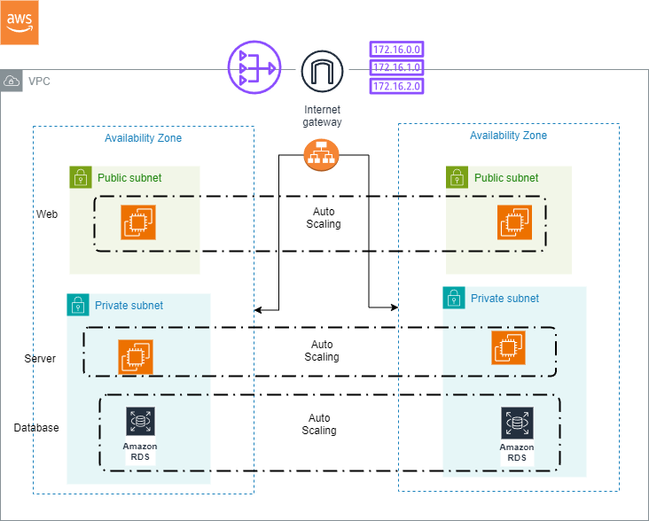
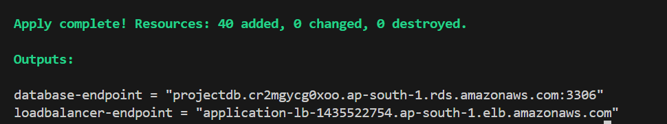

This project is focussing on automating the creation of a three tier architecutre on AWS using the Infrastructure as a code tool "Terraform".

# Project Overview: Automating Three-Tier Architecture on AWS with Terraform

This project focuses on automating the deployment of a scalable three-tier architecture on AWS using Terraform, an Infrastructure as Code tool.

## Three-Tier Architecture Components

### 1. Web Tier
- **Autoscaling Group**: Scales the front-end component for robustness.
- **Bastion Host**: Facilitates secure access to application tier instances in a private subnet.
- **NAT Gateway**: Enables outbound internet traffic from private subnets.

### 2. Application Tier
- **Backend Logic and APIs**: Provides functionality to the web tier.
- **Internet-Facing Load Balancer**: Directs incoming traffic to application instances.

### 3. Database Tier
- **AWS RDS MySQL**: Managed relational database service for data storage.

## Infrastructure Components

### Networking
- **Virtual Private Cloud (VPC)** with multiple subnets (public, private, database).
- **Internet Gateway**: Provides internet access to the VPC.
- **Route Tables** and **Security Groups**: Manage traffic routing and network security.

### Database
- **AWS RDS Instance**: MySQL database instance for persistent data storage.

### Load Balancer
- **Application Load Balancer**: Distributes incoming application traffic across multiple targets.

### Compute
- **Autoscaling Group**: Scales EC2 instances based on traffic demands.
- **Launch Templates**: Defines the configuration of EC2 instances.

## Remote Backend Configuration

To avoid state file conflicts when multiple teams are working, a remote backend is configured.

## Steps to Deploy

1. **Clone Repository**: `git clone https://github.com/akshatmiglani/Terraform-Learning.git`
2. **Change Directory**: `cd <project-directory>`
3. **Configure AWS CLI**:
   - Create a new IAM User with necessary permissions.
   - Configure AWS CLI with access key and secret access key:
```bash
     aws configure
```
4. **Create S3 Bucket for Remote Backend**:
   - Enable versioning for the S3 bucket (mandatory).
   - Update details in backend.tf file
   
5. **Modify tfvars File**:
   - Configure Database username, password, and Amazon AMIs for launch template.

6. **Initialize Terraform**:
```bash
    terraform init
```

7. **Apply Terraform Configuration**:
```bash
   terraform apply
```
8. **View Infrastructure on AWS**:
    Check your AWS account dashboard to view the deployed infrastructure. View the S3 bucket to view the state file.

9. **Access Application**:
    Copy the DNS name provided by the Application Load Balancer into your browser to access the application.
    
10. **Destroy Infrastructure**:
```bash
    terraform destroy
```
    

## Example Output
 