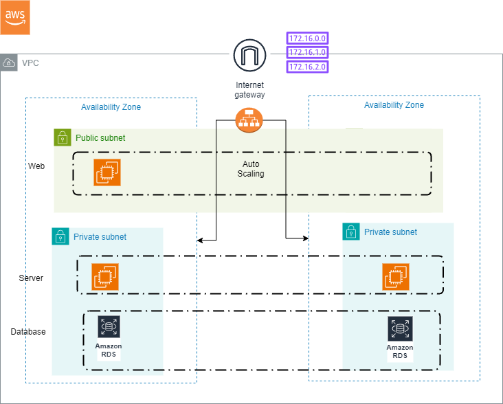

This project is focussing on automating the creation of a three tier architecutre on AWS using the Infrastructure as a code tool "Terraform".

A three tier architecture is basically a kind of system with three layers namely

1. Web Tier: This is the major front-end component. It will be part of an autoscaling group to provide scalbility and robust service. It will also consists of a bastion host which helps to connect to application tier instances in privat esubent. Nat gateway is created which helps in this.

2. Application Tier: Consists of the backend logic and apis required to provide function to web tier. Traffic is directed using an internt facing load balancer.

3. Database Tier: In this an AWS RDS MySQL instance is created.

Components of this infrastructure includes:
Networking
    - Virtual Private Network
    - Subnets in 2AZs, Public, Private and for Database
    - Internt Gateway
    - NAT Gateway
    - Route Table
    - Security Groups

Database
    - AWS RDS INSTANCE

Load Balancer
    - Application Load Balancer

Compute
    - Autoscaling group for EC2 Instances
    - Launch Templates

If mutltiple teams are working together in this infratructure, there is chance of corruption of state files or the possibility of them not being in sync. So remote backend is configured to prevent conflicts.
