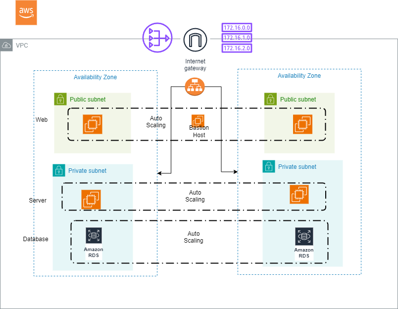
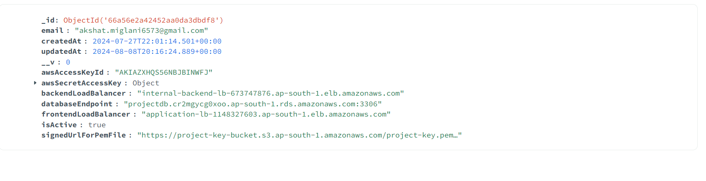
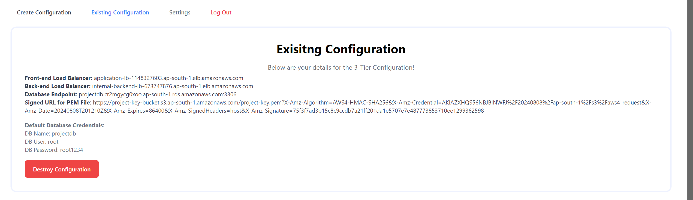

This project is focussing on automating the creation of a three tier architecutre on AWS using the Infrastructure as a code tool "Terraform".

# Project Overview: Automating Three-Tier Architecture on AWS with Terraform

This project focuses on automating the deployment of a scalable three-tier architecture on AWS using Terraform, an Infrastructure as Code tool.

## Three-Tier Architecture Components

### 1. Web Tier
- **Autoscaling Group**: Scales the front-end component for robustness.
- **Bastion Host**: Facilitates secure access to application tier instances in a private subnet.
- **NAT Gateway**: Enables outbound internet traffic from private subnets.

### 2. Application Tier
- **Backend Logic and APIs**: Provides functionality to the web tier.
- **Internet-Facing Load Balancer**: Directs incoming traffic to application instances.

### 3. Database Tier
- **AWS RDS MySQL**: Managed relational database service for data storage.

## Infrastructure Components

### Networking
- **Virtual Private Cloud (VPC)** with multiple subnets (public, private, database).
- **Internet Gateway**: Provides internet access to the VPC.
- **Route Tables** and **Security Groups**: Manage traffic routing and network security.

### Database
- **AWS RDS Instance**: MySQL database instance for persistent data storage.

### Load Balancer
- **Application Load Balancer**: Distributes incoming application traffic across multiple targets.

### Compute
- **Autoscaling Group**: Scales EC2 instances based on traffic demands.
- **Launch Templates**: Defines the configuration of EC2 instances.

## Remote Backend Configuration

To avoid state file conflicts when multiple teams are working, a remote backend is configured.

## Interface
I have created a MERN stack application to have an interface for managing the infrastructure.
Components used for the front-end
1. React
2. Clerk (for Authentication)

Components used for the backend
1. Node & Express
2. MongoDB
3. NGROK for endpoint

# Starting the Application
1.Create a .env.local file in <mark>client</mark> folder with the following:
```bash
VITE_CLERK_PUBLISHABLE_KEY= your-clerk-key
```
   Start the application
   ```bash
   cd client
   npm i
   npm run dev
   ```
2. Create another env file for backebd
```bash
CLERK_WEBHOOK_SECRET=
JENKINS_USERNAME=
JENKINS_TOKEN=
APITOKEN=
ENCRYPTION_KEY=32byterandomencryptionkey
ALGO=aes-256-cbc
```

Start the application

```bash
cd server
npm i
nodemon server.js
```
3. Create an endpoint using ngrok, and start it at port 3000
Example: ngrok http --domain=yourapp.ngrok-free.app 3000

ngrok is used to provide an endpoint for API so that user details can be stored in database directly from clerk. The other use is that it is used to call APIs from jenkins.

## Using the architecture
You need to use the below commands to access the infrastrcture
```bash
# Download the key from Signed URL link provided.
# To set permissions.
chmod 400 "project-key.pem"

# Copying the key to the bastion host, find the IP of the bastion host from the aws console.
scp -i project-key.pem project-key.pem ubuntu@ec2-3-110-46-22.ap-south-1.compute.amazonaws.com:/home/ubuntu/

# Connect to the bastion host
ssh -i "project-key.pem" ubuntu@ec2-3-110-46-22.ap-south-1.compute.amazonaws.com

#Connect to instances in private subnet, again find the private IP from the AWS Console.
ssh -i "project-key.pem" ubuntu@10.0.30.210

# Command to connect to mysql instance
mysql -h  projectdb.cr2mgycg0xoo.ap-south-1.rds.amazonaws.com:3306 -P 3306 -u root -p
```
## Steps to use the terraform modules separetly

1. **Clone Repository**: `git clone https://github.com/akshatmiglani/Terraform-Learning.git`
2. **Change Directory**: `cd <project-directory>`
3. **Configure AWS CLI**:
   - Create a new IAM User with necessary permissions.
   - Configure AWS CLI with access key and secret access key:
```bash
     aws configure
```
4. **Create S3 Bucket for Remote Backend**:
   - Enable versioning for the S3 bucket (mandatory).
   - Update details in backend.tf file
   
5. **Modify tfvars File**:
   - Configure Database username, password, and Amazon AMIs for launch template.

6. **Initialize Terraform**:
```bash
    terraform init
```

7. **Apply Terraform Configuration**:
```bash
   terraform apply
```
8. **View Infrastructure on AWS**:
    Check your AWS account dashboard to view the deployed infrastructure. View the S3 bucket to view the state file.

9. **Access Application**:
    Copy the DNS name provided by the Application Load Balancer into your browser to access the application.
10. **Destroy Infrastructure**:
```bash
    terraform destroy
```
    

## Example Output





