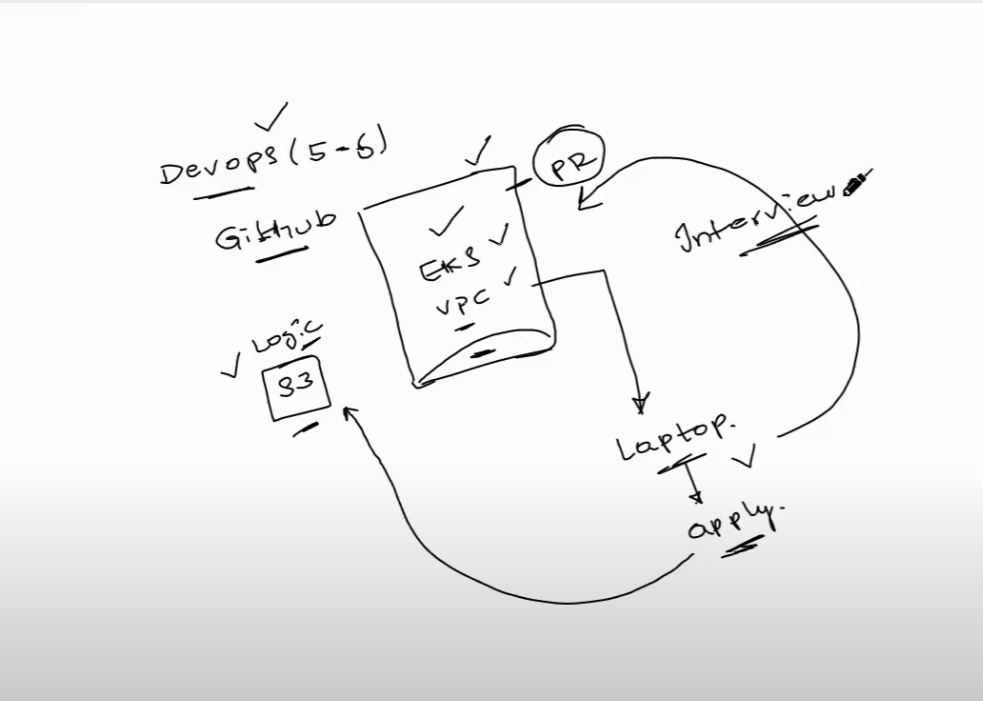

## Terraform Backends
Advantages

Statefile is the heart of a terraform project,
Recording file.
What happen if it is not recording?
You want to modify the instance, so it use information from here.

Before applying , it will check the state file.
Tag is the difference.

Terraform destory-> it uses the state file .

Drawbacks
Contains sensitive information.
Code change in terraform project, update the statefile in local and push it as well.

## Remote Backend

Terraform statefile in external bucket.
Made some modifications and applied the terraform. It is updated at the backend.

Eg. S3, Terraform Cloud, Azure Storage etc.

Raise a PR back to the github and changes will be updated in the backend.

## State Locking
If supported by your backend, Terraform will lock your state for all operations that could write state. This prevents others from acquiring the lock and potentially corrupting your state.

## Process
Create remote backend, eg s3.
Then create backend.tf file with configuration for backend, 
and then run terraform apply.

## Terraform provisioning
xyz-> app.py (flask application)
they want the devops team to make a vpc for testing this,
VPC->PublicSubnet->Route Table(Internet Gateway)-> EC2 instance and deploy this.

Two parts of this applicaaiton
    1) Terraform
    2) CICD

## Provisioner

CREAATION/DESTRUCTION + Code Executon

remote-exec provisioner, local-exec provisioner
remote-exec-> installing files
Copy output in a file

File provisioner very important for copying the files  to a particular location

