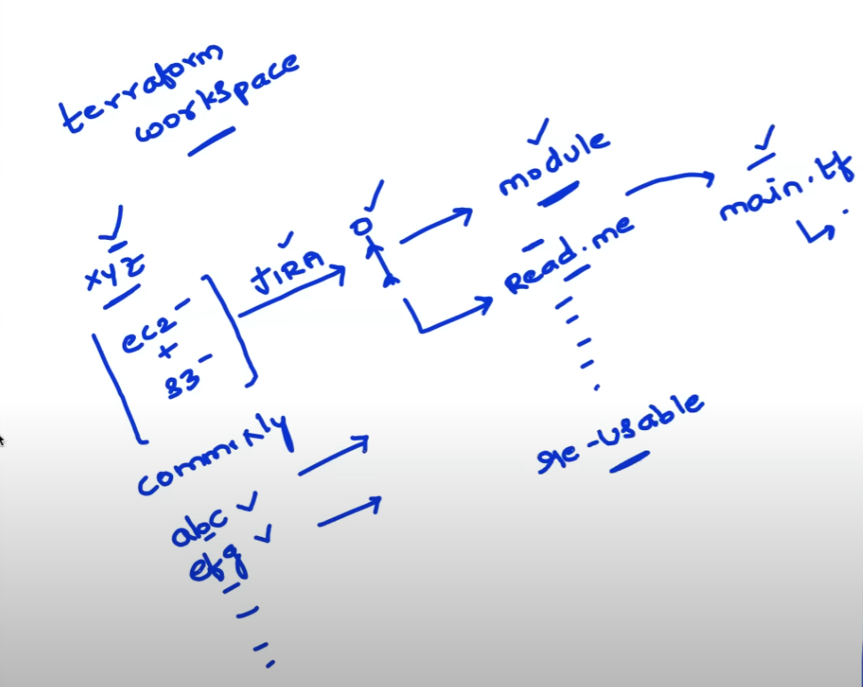
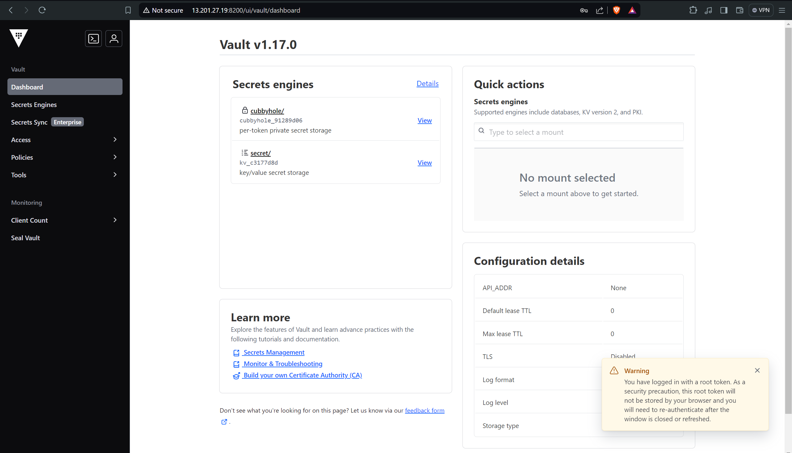
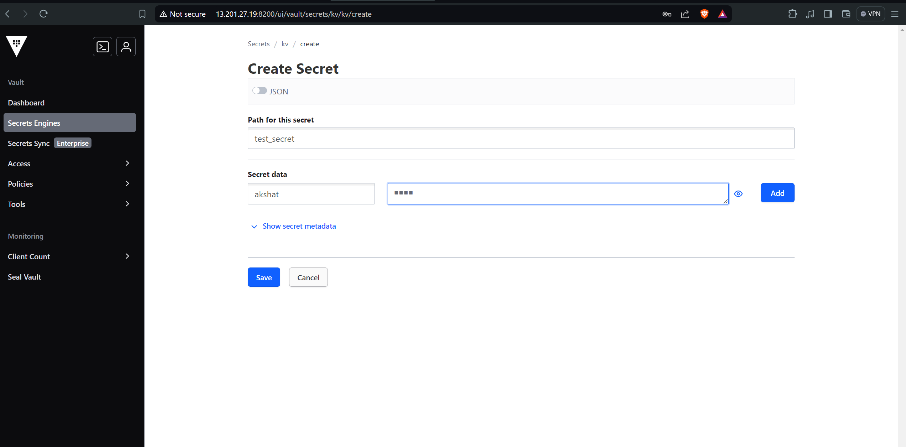
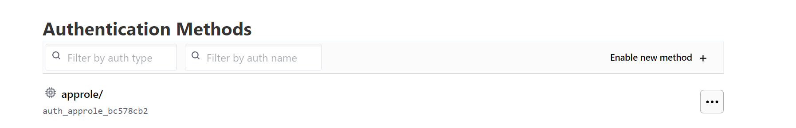

## Terraform Workspaces


For different stages like dev,production, pre-prod etc.

dev.tfvars, stage.tfvars, prod tfvars

donot want to create different folders for them.

Workspaces-> maintain statefile per environment


# terraform workspace new dev

3 ways to handle the tfvars file
1. create three files like stage.tfvars, dev.tfvars, and more


2. or other is creating a map(string)

```bash 
variable "instance_type" {
    description="value"
    type=map(string)

    default = {
        "dev" = "t2.micro"
        "stage" = "t2.medium"
        "prod" = "t2.xlarge"
    }
}
```


# instance_type=lookup(instance_type,terraform.workspace,"t2.micro")


## Secret Management
Hashicorp Vault, secret management -> ansible,terraform, cicd, kubernetes etc.

Use the sensitive attribute
Secret management system
Remote Backend (Encryption)
Environment Variables

# Installing vault
```bash
apt update && apt install gpg
wget -O- https://apt.releases.hashicorp.com/gpg | sudo gpg --dearmor -o /usr/share/keyrings/hashicorp-archive-keyring.gpg

gpg --no-default-keyring --keyring /usr/share/keyrings/hashicorp-archive-keyring.gpg --fingerprint

echo "deb [arch=$(dpkg --print-architecture) signed-by=/usr/share/keyrings/hashicorp-archive-keyring.gpg] https://apt.releases.hashicorp.com $(lsb_release -cs) main" | sudo tee /etc/apt/sources.list.d/hashicorp.list

sudo apt update

sudo apt install vault
```
# Starting vault
vault server -dev -dev-listen-address="0.0.0.0:8200"

export VAULT_ADDR='http://0.0.0.0:8200'






# create a vault policy
```bash
vault policy write terraform - <<EOF
path "*" {
  capabilities = ["list", "read"]
}

path "secrets/data/*" {
  capabilities = ["create", "read", "update", "delete", "list"]
}

path "kv/data/*" {
  capabilities = ["create", "read", "update", "delete", "list"]
}


path "secret/data/*" {
  capabilities = ["create", "read", "update", "delete", "list"]
}

path "auth/token/create" {
capabilities = ["create", "read", "update", "list"]
}
EOF
```

# create  role
```bash
vault write auth/approle/role/terraform \
    secret_id_ttl=10m \
    token_num_uses=10 \
    token_ttl=20m \
    token_max_ttl=30m \
    secret_id_num_uses=40 \
    token_policies=terraform
```
# Role ID Creation
vault read auth/approle/role/terraform/role-id
vault write -f auth/approle/role/terraform/secret-id